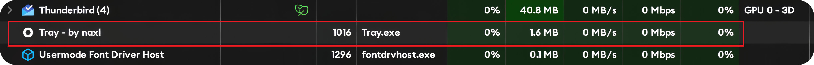
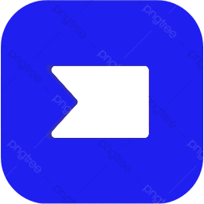

##### THERE WAS NO LAUNCHER OR COMMAND LINE FOR SYSTEM TRAY!! SO I MADE ONE :V

# Tray ('Systray') - A system tray launcher for windows!

(#)

**⭐ Please star this project if this was helpful to you!!**  

<h2 style="color: yellow;">Purpose</h2>

Sick of the awkward **Win+B** and **Enter** dance to access your system tray?! Not first, that's for sure! I scoured online all over the internet for a more sophisticated approach, but I was unable to find anything for as simple as this, got inspired to make Tray Launcher and it fixes that specifically. With a simple single click from a convenient desktop shortcut, you can quickly access your tray icons anytime you need them and manage apps. Additionally, it **automatically puts the tray back** after you're finished, maintaining a tidy and orderly workspace. This implies that you may now focus on being productive and have a smoother workflow!

<h2 style="color: yellow;">Overview</h2>

**Tray** launcher is a lightweight Windows application [only 1,180 kb] and [working set 1.5-.6 mb] designed to enhance your productivity by efficiently managing the system tray. Originally developed as an AutoHotkey (AHK) script, this tool launches the system tray on demand and smartly collapses it when not needed, keeping your workspace organized and clutter-free.

<strong><h2 style="color: yellow;">Features</h2></strong>

- <strong>
On-Demand Launch
</strong>Quickly access the system tray whenever you need it on a click rather than key combination Win + B and Return.

- <strong>
Smart Auto-Collapse
</strong>Automatically collapses the system tray and exit app when it's not in use and loose focus, helping maintain a clean desktop environment.

- <strong>
Lightweight
</strong>Minimal impact on system resources, running seamlessly standalone on demand with just 1.5mb working set.

   <strong>
!!! ** It DOES NOT Run in the BACKGROUND ** !!!
</strong>

  
   
  
- <strong>
Open Source
</strong>Completely open source, allowing customization and improvements by the community/anyone.

## Installation

### Prerequisites

- Windows 7 or higher

### Download

Download Here [Releases](https://github.com/naxl/tray/releases)

### How to Run / Usage

1. Extract the downloaded ZIP file if git clone.
2. Run `Tray.exe` to directly launch the systray, it acts as a shortcut.
3. THE APP EXITS AUTOMATICALLY, and won't keep running in the background. It's a ONCLICK run tool!

## Contributing

Contributions are welcome! If you have ideas for improvements or have found a bug, please open an issue or submit a pull request.

### Steps to Contribute

1. Fork the repository.
2. Create a new branch (`git checkout -b feature-branch`).
3. Make your changes.
4. Commit your changes (`git commit -m 'Add some feature'`).
5. Push to the branch (`git push origin feature-branch`).
6. Open a pull request.

## VirusTotal Detections

- The app is compiled through AHK2EXE.
      
  [Detections](https://www.virustotal.com/gui/file/7f3a5fea468aff5994069bd6acfe7fbb7e33f43a9f4ba08e547029e2ff6acb5d/detection)  
  - False positives : 1/73 (requested) [only coz it detects script inside]
  - Also the script is the direct compilation, so you can <strong>create/reproduce your own executable.</strong>

  #### Steps to reproduce executable!
  - The deployment is reproducible, download AHK v1 and AHK v2 from [sources](https://www.autohotkey.com/download/), run the AHK Dash and compile the cloned script!

## License

This project is licensed under the Apache License Version 2.0 - see the [LICENSE](https://github.com/naxl/tray/blob/main/LICENSE) file for details.

## Contact

For any questions or suggestions, feel free to reach out via [GitHub Issues](https://github.com/naxl/tray/issues).
