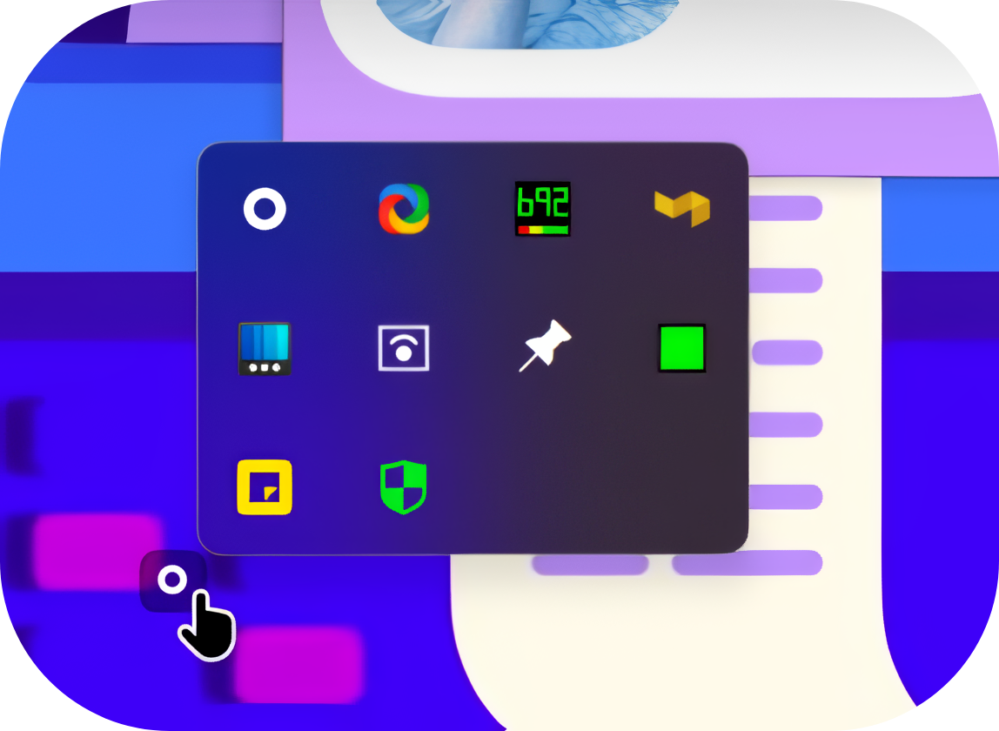

## THERE WAS NO LAUNCHER OR COMMAND LINE FOR SYSTEM TRAY!! 
## SO I MADE ONE :V

# Tray ('Systray') - A system tray launcher for windows!

## Overview

**Tray Launcher** is a lightweight Windows application [only 1,180 kb] and [working set 1.5 mb] designed to enhance your productivity by efficiently managing the system tray. Originally developed as an AutoHotkey (AHK) script, this tool launches the system tray on demand and smartly collapses it when not needed, keeping your workspace organized and clutter-free.

## Features

- **On-Demand Launch**: Quickly access the system tray whenever you need it on a click rather than key combination Win + B and Return.
- **Smart Auto-Collapse**: Automatically collapses the system tray and exit app when it's not in use and loose focus, helping maintain a clean desktop environment.
- **Lightweight**: Minimal impact on system resources, running seamlessly standalone on demand with just 1.5mb working set.
   **IT DOES NOT RUN IN THE BACKGROUND**

  
   
- **Open Source**: Completely open source, allowing customization and improvements by the community/anyone.

## Installation

### Prerequisites

- Windows 7 or higher

### Download

Download Here [Releases](https://github.com/naxl/tray/releases)

### How to Run / Usage

1. Extract the downloaded ZIP file if git clone.
2. Run `Tray.exe` to directly launch the systray, it acts as a shortcut.
3. THE APP EXITS AUTOMATICALLY, and won't keep running in the background. It's a Run-Once tool!

## Contributing

Contributions are welcome! If you have ideas for improvements or have found a bug, please open an issue or submit a pull request.

### Steps to Contribute

1. Fork the repository.
2. Create a new branch (`git checkout -b feature-branch`).
3. Make your changes.
4. Commit your changes (`git commit -m 'Add some feature'`).
5. Push to the branch (`git push origin feature-branch`).
6. Open a pull request.

## License

This project is licensed under the MIT License - see the [LICENSE](https://github.com/naxl/tray/blob/main/LICENSE) file for details.

## Contact

For any questions or suggestions, feel free to reach out via [GitHub Issues](https://github.com/naxl/tray/issues).
